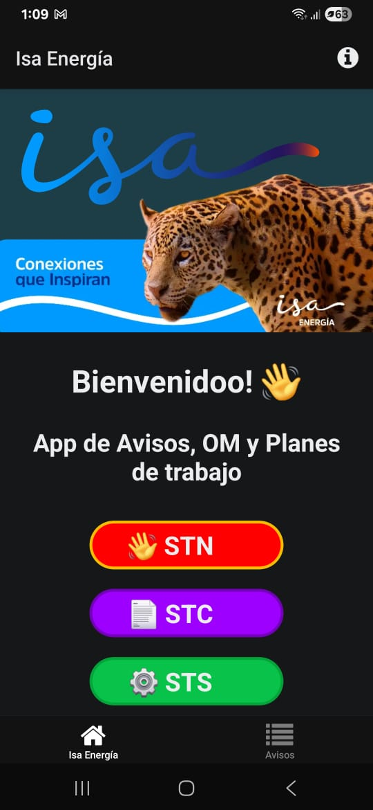
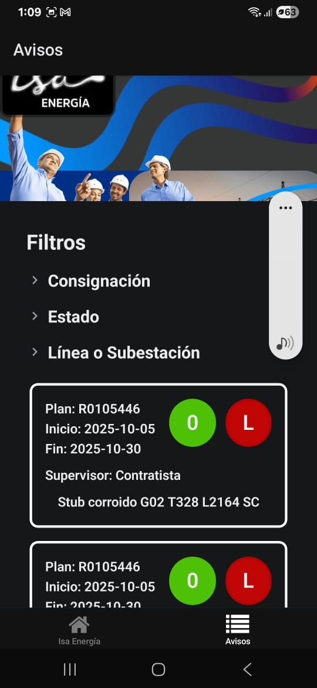
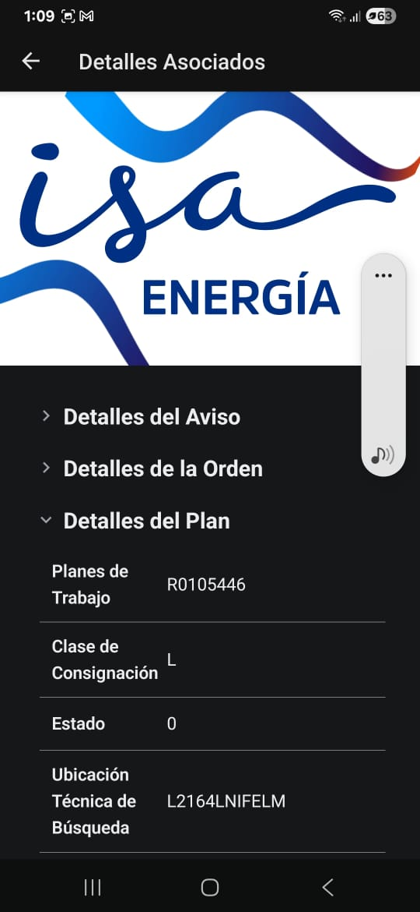
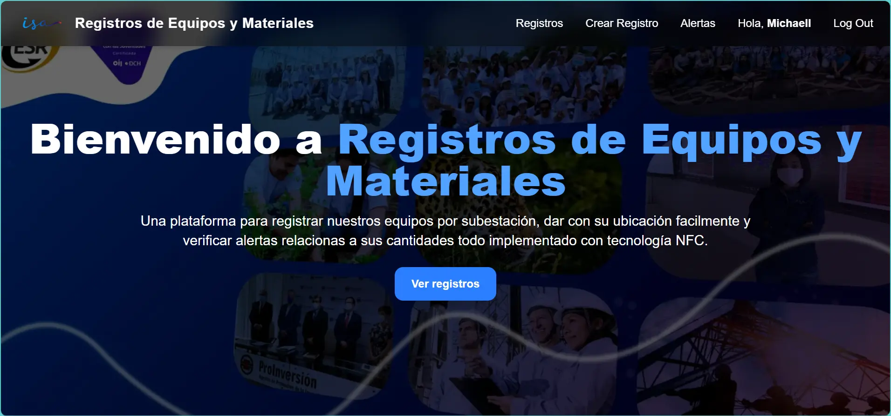
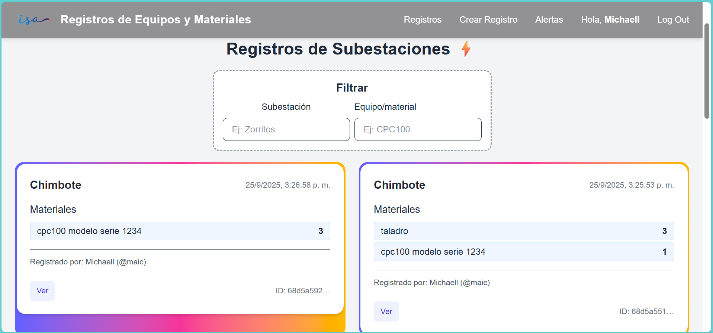
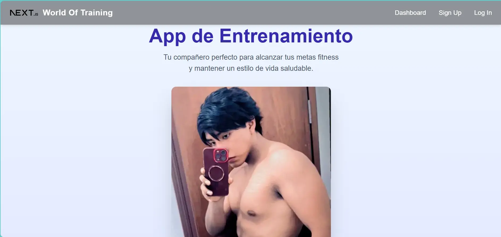
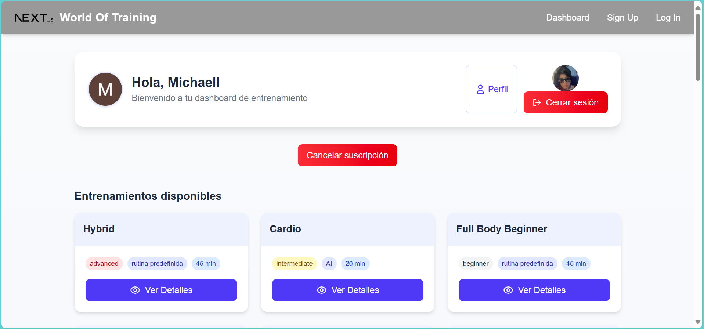
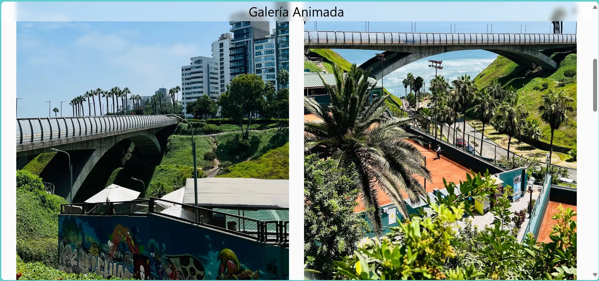
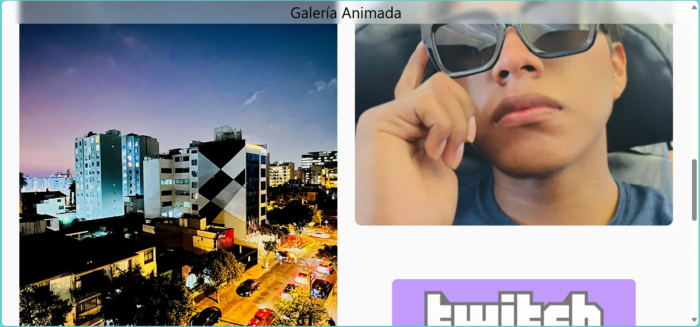

# Hola, mi nombre es Michaell Huanca 👋 

### Ingeniero Informático, de Sistemas y Desarrollador Full-Stack / Mobile / DevOps
<!--
**MichaellSS06/MichaellSS06** is a ✨ _special_ ✨ repository because its `README.md` (this file) appears on your GitHub profile.

Here are some ideas to get you started:

- 🔭 I’m currently working on ...
- 🌱 I’m currently learning ...
- 👯 I’m looking to collaborate on ...
- 🤔 I’m looking for help with ...
- 💬 Ask me about ...
- 📫 How to reach me: ...
- 😄 Pronouns: ...
- ⚡ Fun fact: ...
-->
Soy un desarrollador con experiencia en Next.js, React, Astro, Django, Supabase, MongoDB, React Native, Css, Javascript, Python, ExpressJS, Graphql, Docker, SQL, VBA, VBS, Java.

Me apasiona construir experiencias web rápidas, eficientes y hermosas, prefiero usar herramientas modernas, trabajar con APIs, bases de datos y desplegar en plataformas escalables ya sea hosting dedicado, VPS o nube.

He construido sitios web para pequeñas y medianas empresas con el fin de agilizar sus procesos así que si estás intentando diseñar algo para internet ya sea webs, aplicaciones móviles, landing pages, o crear tiendas online yo te puedo ayudar.

# Experiencia Laboral
### Desarrollador Interno y Operador de Alta Tensión
#### Red de Energía del Perú

Octubre 2023 – Presente

Desarrollo de app móvil en producción (Android/iOS) para avisos, órdenes y planes de trabajo a nivel nacional. Automatización de procesos internos VBS, VBA, Python, Power Apps y Power Automate. Página web para el registro e histórico de equipos y materiales de las subgerencias de transmisión. Mantenimiento, supervisión y monitoreo de la red de transmisión eléctrica en alta tensión (220kV, 60kV, 22.9kV). Uso de equipos M4000, TDR9100, CPC100, TD1, LCM500.

      
### Proyectos Universitarios y Freelance
#### UC y Redes sociales

Marzo 2024 – Presente

Creación una app de entrenamiento físico personalizado, con seguimiento de progreso, histórico de entrenamientos, clasificación, fácil registro usando cuenta de Google o Github, con chats de usuarios y planes de suscripción. Desarrollo de mi página web personal con animaciones y transiciones atractivas de fotografías de viajes, proyectos personales, progreso físico y redes sociales.

# Proyectos
### App de Avisos, Órdenes y Planes de Trabajo
<a href="https://github.com/MichaellSS06" target="_blank" role="link">

</a>

Aplicación móvil para Android y IOS que extrae data de SAP, la almacena en una base de datos y la hace accesible desde el móvil. Implementación: Scripts python para enviar la data a un endpoint creado en Django REST Framework, que a su vez la guarda en una base de datos PostgreSQL de Supabase. La app móvil está desarrollada en React Native y consume la API para mostrar la información a los usuarios.

### Registro e Histórico de Equipos y Materiales
<a href="https://nfc-nextjs-mongodb-auth.vercel.app/" target="_blank" role="link">

</a>
     
Aplicación web para registrar y consultar equipos y materiales de las subgerencias de transmisión con NFC desde el móvil. Implementación: Frontend desarrollado en Next.js con Tailwind CSS para un diseño responsivo y moderno. Backend en NextJS con Node.js que maneja la lógica de negocio y la comunicación con la base de datos en MongoDBAtlas. Se usó JWT para la autenticación segura de usuarios.

### World Of Training: Web de Entrenamiento
<a href="https://nextjs-supabase-baas-traeai.vercel.app/" target="_blank" role="link">

</a>
     
Aplicación web con rutinas de entrenamiento físico personalizadas, seguimiento de progreso, históricos y puntuaciones, tiene salas de chats y planes de suscripción con prueba trial. Implementación: Frontend en NextJS con Tailwind CSS para una experiencia de usuario fluida y atractiva. Backend en Supabase donde se maneja la base de datos, autenticación con OAuth, storage para archivos e imágenes, edge functions para API, y realtime para chats. Se integró Paddle para la gestión de pagos y suscripciones.

### Mi web personal
<a href="https://astro-css-landing-gym.vercel.app/" target="_blank" role="link">

</a>
     
Página web donde adjunto fotografías de mis viajes con animaciones y transiciones, proyectos personales, progreso físico y redes sociales. Implementación: Desarrollada en Astro para un rendimiento óptimo y tiempos de carga rápidos. Utiliza Markdown para gestionar el contenido de manera sencilla y Tailwind CSS para un diseño limpio y responsivo.
